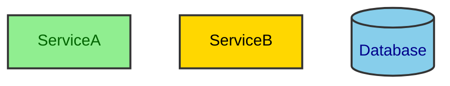
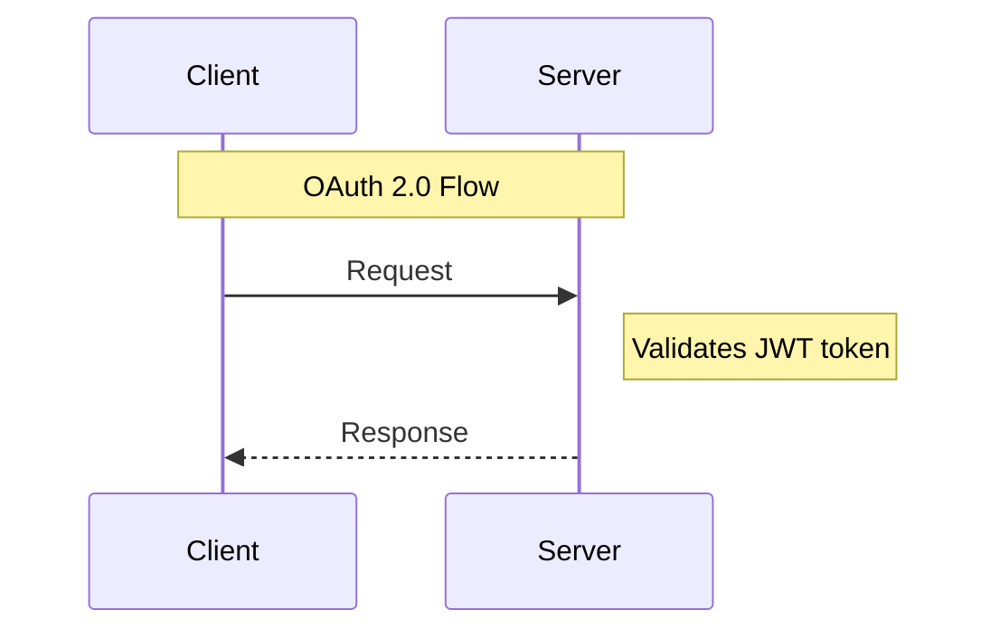

# Design Document with Mermaid

Create comprehensive, production-ready design documents with strategically placed Mermaid diagrams.

## Overview

This skill provides templates, references, and workflows for creating professional design documents that effectively combine written technical specifications with visual Mermaid diagrams. It covers five major design document types with complete templates and Mermaid diagram integration.

## When to Use This Skill

Use this skill when:

1. **Creating design documents** - "Create a design doc for the contact API"
2. **Updating design docs** - "Update the design docs to match current changes in code"
3. **Syncing documentation** - "Sync the current source code with the design doc"
4. **Documenting architecture** - "Document the AlloyDB migration architecture"
5. **Feature planning** - "Create a feature design doc for authentication flow"

**Do NOT use this skill for:**
- Standalone diagrams without documentation (use mermaid-architect agent instead)
- Simple diagram requests (use mermaid-architect agent instead)

## Design Document Types

This skill supports five comprehensive design document types:

### 1. Architecture Design Document

**Use for:** System-wide architectural decisions and patterns

**Template:** `assets/architecture-design-template.md`

**Includes:**
- System context (C4 diagrams)
- High-level architecture (component diagrams)
- Data architecture (ER diagrams)
- Integration points (sequence diagrams)
- Security architecture (flowcharts, state diagrams)
- Deployment architecture (infrastructure diagrams)
- Monitoring strategy (architecture diagrams)
- Decision log (ADRs)

**Key Mermaid Diagrams:**
- C4 Context diagrams for system boundaries
- Architecture diagrams for infrastructure
- Sequence diagrams for API flows
- ER diagrams for data models
- State diagrams for authentication
- Gantt charts for future enhancements

### 2. API Design Document

**Use for:** REST/GraphQL API specifications with visual flows

**Template:** `assets/api-design-template.md`

**Includes:**
- API overview and base URLs
- Authentication flow (sequence diagrams)
- Endpoint specifications
- Data models (ER diagrams)
- Request/response flows (sequence diagrams)
- Error handling (state diagrams)
- Rate limiting policies
- Webhooks (sequence diagrams)

**Key Mermaid Diagrams:**
- Sequence diagrams for auth flows
- ER diagrams for data models
- Flowcharts for request/response paths
- State diagrams for error handling
- Architecture diagrams for API structure

### 3. Feature Design Document

**Use for:** Individual feature specifications with UX and technical details

**Template:** `assets/feature-design-template.md`

**Includes:**
- Feature overview and user stories
- User journey (journey maps)
- User flow (flowcharts)
- Technical design (class diagrams)
- Sequence diagrams for interactions
- State machines for workflows
- Data model (ER diagrams)
- Deployment plan (Gantt charts)

**Key Mermaid Diagrams:**
- User journey maps for UX
- Flowcharts for user flows
- Class diagrams for component design
- Sequence diagrams for API calls
- State diagrams for lifecycle
- ER diagrams for data
- Gantt charts for rollout

### 4. Database Design Document

**Use for:** Database schema, data models, and query patterns

**Template:** `assets/database-design-template.md`

**Includes:**
- Comprehensive ER diagrams
- Table specifications with SQL
- Index strategy (diagrams)
- Data access patterns (sequence diagrams)
- Partitioning strategy (diagrams)
- Backup/recovery (flowcharts)
- Scaling strategy (architecture diagrams)

**Key Mermaid Diagrams:**
- ER diagrams (primary focus)
- Architecture diagrams for sharding
- Sequence diagrams for query flows
- Flowcharts for backup/recovery
- Architecture diagrams for replication

### 5. System Design Document

**Use for:** Complete system design including scale, performance, and reliability

**Template:** `assets/system-design-template.md`

**Includes:**
- System context (C4 diagrams)
- High-level architecture (multi-layer diagrams)
- Component design (class diagrams)
- Data flow (sequence diagrams)
- Database design (ER diagrams)
- Scaling strategy (architecture diagrams)
- Caching layers (architecture diagrams)
- Message queue architecture (flowcharts)
- Security architecture (multi-layer diagrams)
- Monitoring (architecture diagrams)
- Disaster recovery (flowcharts)

**Key Mermaid Diagrams:**
- C4 Context diagrams
- Multi-layer architecture diagrams
- Sequence diagrams for data flows
- ER diagrams for data models
- Architecture diagrams for infrastructure
- Flowcharts for processes
- Gantt charts for roadmap

## How to Use This Skill

### Step 1: Determine Document Type

Ask yourself:
- Documenting entire system architecture? → Architecture Design
- Documenting an API? → API Design
- Documenting a single feature? → Feature Design
- Documenting database schema? → Database Design
- Documenting a complete system? → System Design

### Step 2: Use the Template

1. **Read the appropriate template** from `assets/` directory:
   ```
   assets/architecture-design-template.md
   assets/api-design-template.md
   assets/feature-design-template.md
   assets/database-design-template.md
   assets/system-design-template.md
   ```

2. **Copy template structure** to new document in target project

3. **Replace placeholders** with actual content:
   - `[System Name]` → Actual system name
   - `[YYYY-MM-DD]` → Current date
   - `[Name]` → Author name
   - `[Description]` → Actual descriptions

### Step 3: Add/Customize Mermaid Diagrams

1. **Reference diagram guide** from `references/mermaid-diagram-guide.md` to:
   - Choose the right diagram type for each section
   - Use correct Mermaid syntax
   - Follow best practices

2. **Replace template diagrams** with actual system diagrams:
   - Update node names to match actual components
   - Update relationships to match actual flows
   - Add/remove nodes as needed
   - Customize styling for clarity

3. **Validate diagram syntax** before finalizing:
   - Check for balanced quotes
   - Verify relationship syntax
   - Test complex diagrams

### Step 4: Sync with Code (For Updates)

When code changes and design docs need updating:

1. **Analyze code changes:**
   - Use `git diff` to see what changed
   - Identify affected components
   - Note new/removed/modified elements

2. **Update relevant sections:**
   - If API changed → Update API endpoints, sequence diagrams
   - If database changed → Update ER diagrams, table specs
   - If architecture changed → Update architecture diagrams
   - If workflow changed → Update state diagrams, flowcharts

3. **Update diagrams:**
   - Add new components/nodes
   - Remove obsolete components
   - Update relationships
   - Adjust labels and descriptions

### Step 5: Place in Project

Standard location: `docs/design/`

**Naming convention:**
```
docs/design/architecture-[system-name]-[YYYY-MM-DD].md
docs/design/api-[api-name]-[YYYY-MM-DD].md
docs/design/feature-[feature-name]-[YYYY-MM-DD].md
docs/design/database-[db-name]-[YYYY-MM-DD].md
docs/design/system-[system-name]-[YYYY-MM-DD].md
```

**Example:**
```
docs/design/architecture-contact-manager-2025-01-15.md
docs/design/api-contacts-v1-2025-01-15.md
docs/design/feature-oauth-authentication-2025-01-15.md
docs/design/database-alloydb-schema-2025-01-15.md
docs/design/system-peak6-contactmanager-2025-01-15.md
```

## Using the Mermaid Diagram Guide

The `references/mermaid-diagram-guide.md` provides:

### 1. Diagram Type Selection Matrix

Use this to choose the right diagram type for your documentation needs.

**Quick selection:**
- System boundaries? → C4 Context
- API calls? → Sequence
- Database schema? → ER Diagram
- Workflow/status? → State Diagram
- Business logic? → Flowchart
- Project timeline? → Gantt Chart
- User experience? → User Journey

### 2. Syntax References

For each diagram type, the guide provides:
- Complete syntax examples
- Common patterns
- Best practices
- Common errors and fixes

**When creating diagrams:**
1. Find the diagram type in the guide
2. Copy the syntax template
3. Customize for your use case
4. Validate syntax

### 3. Best Practices

The guide includes:
- When to use each diagram type
- How to keep diagrams focused
- Naming conventions
- Styling patterns
- Common anti-patterns to avoid

## Workflow Examples

### Example 1: Creating Architecture Doc

```
User Request: "Create an architecture design doc for the contact manager system"

Process:
1. Determine type: Architecture Design
2. Read template: assets/architecture-design-template.md
3. Create new doc: docs/design/architecture-contact-manager-2025-01-15.md
4. Fill in sections:
   - Executive Summary (what the system does)
   - System Context (C4 diagram showing users, external systems)
   - Architecture Overview (component diagram)
   - Data Architecture (ER diagram for database)
   - Integration Points (sequence diagram for OAuth)
   - Security Architecture (multi-layer diagram)
   - Deployment Architecture (infrastructure diagram)
5. Reference mermaid-diagram-guide.md for each diagram type
6. Customize diagrams to match actual system
7. Validate all Mermaid syntax
8. Save to docs/design/
```

### Example 2: Updating Design Doc After Code Changes

```
User Request: "Update the design docs to match current changes in code"

Process:
1. Analyze changes: git diff to see what changed
2. Identify impact:
   - New API endpoint added → Update API design doc
   - Database schema changed → Update database design doc
   - New component added → Update architecture design doc
3. For each affected doc:
   - Read current version
   - Update relevant sections
   - Add/update Mermaid diagrams
   - Update sequence diagrams for new flows
   - Update ER diagrams for schema changes
4. Version the updated docs with new date
```

### Example 3: Creating API Design Doc

```
User Request: "Create a design doc for the contacts API with sequence diagrams"

Process:
1. Determine type: API Design
2. Read template: assets/api-design-template.md
3. Create: docs/design/api-contacts-v1-2025-01-15.md
4. Document:
   - API overview (base URLs, auth method)
   - Authentication flow (sequence diagram)
   - All endpoints (GET, POST, PUT, DELETE /contacts)
   - Data models (ER diagram for contacts schema)
   - Request/response flows (sequence diagrams)
   - Error handling (state diagram)
   - Rate limiting policy
5. Create sequence diagrams for:
   - OAuth authentication flow
   - Create contact flow
   - Update contact flow
   - Error scenarios
6. Reference mermaid-diagram-guide.md for sequence diagram syntax
```

## Integration with mermaid-architect Agent

**Current workflow:**
- User asks for standalone diagram → mermaid-architect agent
- User asks for design doc → this skill

**Future integration (when refactoring mermaid-architect):**
- mermaid-architect will use this skill for diagram generation
- This skill provides templates and structure
- mermaid-architect provides diagram generation expertise
- Combined: comprehensive design docs with expert diagrams

## Tips for Effective Design Docs

### 1. Start with High-Level, Then Detail

- Begin with system context and overview diagrams
- Progress to detailed component and sequence diagrams
- Don't try to document everything at once

### 2. Focus on Critical Paths

- Prioritize happy path flows
- Document key error scenarios
- Skip trivial or obvious details

### 3. Keep Diagrams Focused

- One diagram = one concept
- Max 10-12 nodes per diagram
- Break complex diagrams into multiple views

### 4. Use Consistent Styling with High Contrast

**CRITICAL**: All Mermaid diagrams MUST use high-contrast colors for accessibility and readability.

**Contrast Rules**:
- **Light backgrounds** → **Dark text colors**
- **Dark backgrounds** → **Light text colors**
- Never use light text on light backgrounds or dark text on dark backgrounds

✅ **Good - High Contrast Examples**:



❌ **Bad - Poor Contrast**:

```mermaid
graph TB
    %% Missing color property - may have poor contrast
    classDef badStyle fill:#F0F0F0,stroke:#E0E0E0  %% Light on light!
    classDef alsoBad fill:#333333,stroke:#222222   %% May have dark on dark!
```

**Common High-Contrast Color Combinations**:

| Background Fill | Text Color | Use Case |
|-----------------|------------|----------|
| `#90EE90` (light green) | `color:darkgreen` | Success states, primary services |
| `#FFD700` (gold) | `color:black` | Warning states, secondary services |
| `#87CEEB` (sky blue) | `color:darkblue` | Info states, databases |
| `#FFB6C1` (pink) | `color:black` | Error states |
| `#FFE4B5` (peach) | `color:black` | Public resources |
| `#E6E6FA` (lavender) | `color:darkblue` | Private resources, IAM |
| `#F0F0F0` (light gray) | `color:black` | Neutral elements |
| `#2C3E50` (dark blue) | `color:white` | Dark theme primary |
| `#34495E` (dark gray) | `color:#ECF0F1` | Dark theme secondary |

### 5. Add Context with Notes



### 6. Ensure Accessibility with High-Contrast Colors

**MANDATORY for all classDef styles**:

Every `classDef` statement MUST include a `color:` property with appropriate contrast:

```mermaid
%% ALWAYS include color: property
classDef public fill:#FFE4B5,stroke:#333,stroke-width:2px,color:black     ✅ Correct
classDef iam fill:#E6E6FA,stroke:#333,stroke-width:2px,color:darkblue     ✅ Correct

classDef bad fill:#FFE4B5,stroke:#333,stroke-width:2px                    ❌ Missing color
```

**Quick test**: Can you easily read the text on the background color?
- If **NO** → Adjust the `color:` value for better contrast
- If **YES** → You're good to go

### 7. Document Decisions

Include ADRs (Architectural Decision Records) for key choices:
- What was decided
- Why it was decided
- What alternatives were considered
- What are the trade-offs

## Common Patterns

### Creating New Design Doc

1. Choose template type
2. Copy template to target location
3. Replace all `[placeholders]`
4. Fill in executive summary
5. Complete requirements section
6. Create diagrams section by section
7. Reference mermaid-diagram-guide.md for syntax
8. Validate all diagrams
9. Review for completeness

### Updating Existing Design Doc

1. Read current version
2. Identify what changed in code
3. Update affected sections
4. Update/add/remove diagrams as needed
5. Maintain version history
6. Note what changed in doc

### Syncing with Code

1. Run `git diff` to see changes
2. Map changes to design doc sections
3. Update text descriptions
4. Update Mermaid diagrams
5. Add new diagrams if new components added
6. Remove diagrams for removed components
7. Update version and date

## Troubleshooting

### Diagram Won't Render

**Check:**
- Balanced quotes
- Valid relationship syntax
- No trailing commas
- Proper indentation
- Special characters escaped

**Fix:**
- Validate syntax using mermaid-diagram-guide.md
- Test in Mermaid Live Editor (mermaid.live)
- Check for typos in node IDs

### Choosing Wrong Diagram Type

**If showing temporal flow:** Use Sequence Diagram
**If showing data structure:** Use ER Diagram
**If showing state changes:** Use State Diagram
**If showing process flow:** Use Flowchart
**If showing system boundaries:** Use C4 Context

**Reference:** Use diagram selection matrix in mermaid-diagram-guide.md

### Design Doc Too Complex

**Solution:**
- Break into multiple focused documents
- Create separate docs for different aspects
- Use cross-references between docs
- Keep each doc focused on one concern

Example:
- Main architecture doc → high-level overview
- Separate API doc → detailed API specs
- Separate database doc → schema details
- Link between them for navigation

## Quick Reference

### Available Templates

| Template | Location | Use For |
|----------|----------|---------|
| Architecture | `assets/architecture-design-template.md` | System-wide architecture |
| API | `assets/api-design-template.md` | API specifications |
| Feature | `assets/feature-design-template.md` | Individual features |
| Database | `assets/database-design-template.md` | Database schema |
| System | `assets/system-design-template.md` | Complete system design |

### Available References

| Reference | Location | Purpose |
|-----------|----------|---------|
| Mermaid Guide | `references/mermaid-diagram-guide.md` | Diagram syntax and best practices |

### Diagram Type Quick Select

```
Need to show...              → Use this diagram type
-----------------            → ---------------------
System boundaries            → C4 Context
API interactions             → Sequence
Code structure               → Class
Database schema              → ER Diagram
State transitions            → State Diagram
Process flow                 → Flowchart
Timeline                     → Gantt Chart
User experience              → User Journey
Infrastructure               → Architecture
```

## Next Steps After Creating Design Doc

1. **Review** - Have team review for accuracy
2. **Version** - Add to version control (git)
3. **Link** - Link from README.md or docs index
4. **Maintain** - Update as code changes
5. **Share** - Share with stakeholders

## Remember

- **Design docs are living documents** - Update them as code evolves
- **Diagrams should clarify, not confuse** - Keep them focused and simple
- **Templates are starting points** - Customize to your project's needs
- **Reference the guide** - Use mermaid-diagram-guide.md for correct syntax
- **Focus on value** - Document what helps the team, not everything

---

**Version:** 1.0
**Last Updated:** 2025-01-02
**Maintained by:** Claude Code Skills
