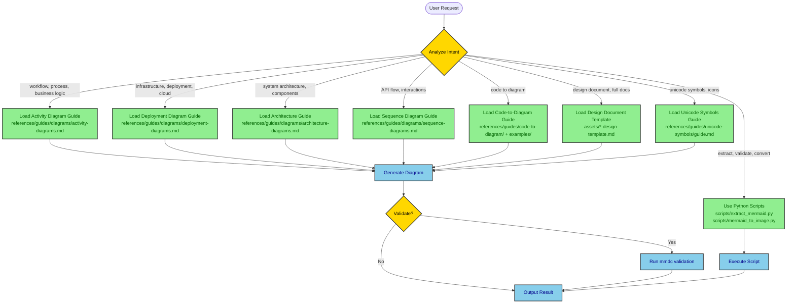

# Mermaid Architect - Hierarchical Diagram & Documentation Skill

A comprehensive Mermaid diagram and documentation system with intelligent orchestration, specialized guides, and code-to-diagram capabilities.

## 🎯 Decision Tree - Intelligent Guide Selection

**How this skill works:**

1. **User makes a request** → Skill analyzes intent
2. **Skill determines diagram/document type** → Loads appropriate guide(s)
3. **AI reads specialized guide** → Generates diagram/document using templates
4. **Result delivered** → With validation and export options

**User Intent Analysis:**



## 📚 Available Guides & Resources

### Diagram Type Guides (`references/guides/diagrams/`)

| Guide | Full Path | Load When User Wants | Examples |
|-------|-----------|---------------------|----------|
| Activity Diagrams | `references/guides/diagrams/activity-diagrams.md` | Workflows, processes, business logic, user flows, decision trees | "Show checkout flow", "Document ETL pipeline", "Create approval workflow" |
| Deployment Diagrams | `references/guides/diagrams/deployment-diagrams.md` | Infrastructure, cloud architecture, K8s, serverless, network topology | "Show AWS architecture", "Document GCP deployment", "Create K8s diagram" |
| Architecture Diagrams | `references/guides/diagrams/architecture-diagrams.md` | System architecture, component design, high-level structure | "Show system components", "Document microservices", "Architecture overview" |
| Sequence Diagrams | `references/guides/diagrams/sequence-diagrams.md` | API interactions, service communication, request/response flows | "Show API call sequence", "Document auth flow", "Service interactions" |

### Code-to-Diagram Guide & Examples

| Resource | Full Path | What It Provides |
|----------|-----------|------------------|
| **Master Guide** | `references/guides/code-to-diagram/README.md` | Complete workflow for analyzing any codebase and extracting diagrams |
| **Spring Boot** | `examples/spring-boot/README.md` | Controller→Service→Repository architecture, deployment config, sequence from methods, activity from business logic |
| **FastAPI** | `examples/fastapi/README.md` | Python async patterns, Pydantic models, dependency injection, cloud deployment |
| **React** | `examples/react/README.md` | Component hierarchy, state management, data flow, build pipeline |
| **Python ETL** | `examples/python-etl/README.md` | Data pipeline, transformation steps, error handling, scheduling |
| **Node/Express** | `examples/node-webapp/README.md` | Middleware chain, route handlers, async patterns, deployment |
| **Java Web App** | `examples/java-webapp/README.md` | Traditional MVC, servlet containers, WAR deployment |

### Design Document Templates

| Template | Full Path | Use For | Load When |
|----------|-----------|---------|-----------|
| Architecture Design | `assets/architecture-design-template.md` | System-wide architecture | "Create architecture doc", "Document system design" |
| API Design | `assets/api-design-template.md` | API specifications | "API design doc", "Document REST API" |
| Feature Design | `assets/feature-design-template.md` | Feature planning | "Feature design", "Plan new feature" |
| Database Design | `assets/database-design-template.md` | Database schema | "Database design", "Document schema" |
| System Design | `assets/system-design-template.md` | Complete system | "System design doc", "Full system documentation" |

### Unicode Symbols Guide

**Full Path:** `references/guides/unicode-symbols/guide.md`

**Load when user mentions:** "unicode symbols", "emoji in diagrams", "semantic icons", "add symbols"

**Quick Reference:**
- 📦 Infrastructure: ☁️ 🌐 🔌 📡 🗄️
- ⚙️ Compute: ⚙️ ⚡ 🔄 ♻️ 🚀 💨
- 💾 Data: 💾 📦 📊 📈 🗃️ 🧊
- 📨 Messaging: 📨 📬 📤 📥 🐰 📢
- 🔐 Security: 🔐 🔑 🛡️ 🚪 👤 🎫
- 📝 Monitoring: 📝 📊 🚨 ⚠️ ✅ ❌

### Python Scripts (`scripts/`)

| Script | Use For | Load When |
|--------|---------|-----------|
| `extract_mermaid.py` | Extract diagrams from Markdown, validate syntax, replace with images | "extract diagrams", "validate mermaid", "find all diagrams" |
| `mermaid_to_image.py` | Convert .mmd to PNG/SVG, batch conversion, custom themes | "convert to image", "render diagram", "create PNG" |

## 🚀 Usage Patterns

### Pattern 1: Single Diagram Request

**User:** "Create an activity diagram for the user login flow"

**Skill Actions:**
1. Identify intent: **activity diagram** + **authentication workflow**
2. Load guide: `references/guides/diagrams/activity-diagrams.md`
3. Reference Unicode symbols: `references/guides/unicode-symbols/guide.md`
4. Generate diagram using templates from guide
5. Apply high-contrast styling
6. Output complete Mermaid code

### Pattern 2: Code-to-Diagram

**User:** "Generate deployment diagram from my Spring Boot application.yml"

**Skill Actions:**
1. Identify intent: **deployment diagram** + **Spring Boot** + **configuration**
2. Load guides:
   - `references/guides/diagrams/deployment-diagrams.md`
   - `examples/spring-boot/README.md`
3. Analyze configuration (datasource, cache, security settings)
4. Map config to infrastructure components
5. Generate deployment diagram with Unicode symbols
6. Include resource specifications

### Pattern 3: Complete Design Document

**User:** "Create an API design document for the contacts API"

**Skill Actions:**
1. Identify intent: **full design doc** + **API**
2. Load template: `assets/api-design-template.md`
3. Load diagram guides:
   - Sequence diagrams (auth flow, CRUD operations)
   - ER diagrams (data models)
   - Architecture diagrams (API structure)
4. Generate complete document with embedded diagrams
5. Place in `docs/design/` with timestamp

### Pattern 4: Extract and Validate

**User:** "Extract all Mermaid diagrams from design.md and validate them"

**Skill Actions:**
1. Identify intent: **extract** + **validate**
2. Use script: `scripts/extract_mermaid.py design.md --validate`
3. Check mmdc is installed
4. Extract all diagrams
5. Validate each with mmdc
6. Report results with line numbers

### Pattern 5: Batch Image Conversion

**User:** "Convert all .mmd files in diagrams/ to PNG images"

**Skill Actions:**
1. Identify intent: **convert** + **batch** + **PNG**
2. Use script: `scripts/mermaid_to_image.py diagrams/ output/ --format png`
3. Process all diagrams
4. Apply default theme and transparent background
5. Output success summary

## 🎨 Unicode Semantic Symbols

Always use Unicode symbols to enhance diagram clarity. Common patterns:

### Infrastructure & Deployment

```mermaid
graph TB
    Client[👤 User] --> LB[🌐 Load Balancer]
    LB --> App1[⚙️ App Server 1]
    LB --> App2[⚙️ App Server 2]
    App1 --> DB[(💾 Database)]
    App1 --> Cache[(⚡ Redis)]
```


### Activity Flow with States

```mermaid
flowchart TD
    Start([🚀 Start]) --> Process[⚙️ Process Data]
    Process --> Check{✓ Valid?}
    Check -->|Yes| Save[💾 Save]
    Check -->|No| Error[❌ Error]
    Save --> Complete([✅ Complete])
```


### Microservices Architecture

```mermaid
graph TB
    API[🌐 API Gateway] --> Auth[🔐 Auth Service]
    API --> Orders[📋 Order Service]
    Orders --> Queue[📬 Message Queue]
    Queue --> Worker[⚙️ Background Worker]
    Worker --> Storage[📦 Object Storage]
```


**For complete symbol reference, load:** `references/guides/unicode-symbols/guide.md`

## 🔧 Python Utilities

### Extract Mermaid Diagrams

```bash
# List all diagrams
python scripts/extract_mermaid.py document.md --list-only

# Extract to separate files
python scripts/extract_mermaid.py document.md --output-dir diagrams/

# Validate all diagrams
python scripts/extract_mermaid.py document.md --validate

# Replace with image references (for Confluence upload)
python scripts/extract_mermaid.py document.md --replace-with-images \
  --image-format png --output-markdown output.md
```

### Convert to Images

```bash
# Single conversion
python scripts/mermaid_to_image.py diagram.mmd output.png

# With custom settings
python scripts/mermaid_to_image.py diagram.mmd output.svg \
  --theme dark --background white --width 1200

# Batch convert directory
python scripts/mermaid_to_image.py diagrams/ output/ --format png --recursive

# From stdin
echo "graph TD; A-->B" | python scripts/mermaid_to_image.py - output.png
```

## 📖 Decision Tree Examples

### Example 1: User Asks for Workflow Diagram

**Input:** "Show the checkout process workflow"

**Skill Decision Path:**
```
1. Analyze: workflow, process → ACTIVITY DIAGRAM
2. Load guide: guides/diagrams/activity-diagrams.md
3. Find pattern: E-commerce checkout (template exists in guide)
4. Generate using template + Unicode symbols
5. Output activity diagram with decision points
```

**Output:** Complete activity diagram with Unicode symbols for cart, payment, order states.

### Example 2: User Provides Spring Boot Code

**Input:** "Here's my Spring Boot controller, create diagrams"

**Skill Decision Path:**
```
1. Analyze: Spring Boot, code provided → CODE-TO-DIAGRAM + SPRING BOOT
2. Load guides:
   - examples/spring-boot/README.md
   - guides/diagrams/architecture-diagrams.md (for structure)
   - guides/diagrams/sequence-diagrams.md (for method calls)
   - guides/diagrams/activity-diagrams.md (for business logic)
3. Generate multiple diagrams:
   a. Architecture diagram from @RestController/@Service/@Repository annotations
   b. Sequence diagram from method call chain
   c. Activity diagram from business logic flow
4. Output all diagrams with explanations
```

**Output:** 3-4 diagrams showing different views of the Spring Boot application.

### Example 3: User Wants Infrastructure Documentation

**Input:** "Document my GCP Cloud Run deployment with AlloyDB"

**Skill Decision Path:**
```
1. Analyze: infrastructure, GCP, Cloud Run → DEPLOYMENT DIAGRAM
2. Load guides:
   - guides/diagrams/deployment-diagrams.md
   - examples/spring-boot/ or examples/fastapi/ (if code provided)
3. Check for IaC files (Pulumi, Terraform, docker-compose)
4. Generate deployment diagram with:
   - Cloud Run services with specs
   - VPC connector
   - AlloyDB cluster
   - Security (IAM, Secret Manager)
   - Monitoring
5. Apply Unicode symbols for clarity
6. Output with resource specifications
```

**Output:** Complete GCP deployment diagram with all resources labeled.

## 🎯 High-Contrast Styling (MANDATORY)

**ALL diagrams MUST use high-contrast colors:**

```mermaid
graph TB
    classDef primary fill:#90EE90,stroke:#333,stroke-width:2px,color:darkgreen
    classDef secondary fill:#87CEEB,stroke:#333,stroke-width:2px,color:darkblue
    classDef database fill:#E6E6FA,stroke:#333,stroke-width:2px,color:darkblue
    classDef error fill:#FFB6C1,stroke:#DC143C,stroke-width:2px,color:black

    %% Every classDef MUST have color: property
```

**Rules:**
- Light background → Dark text color
- Dark background → Light text color
- Always specify `color:` in every `classDef`

## 📂 File Organization

```
design-doc-mermaid/
├── SKILL.md                          # This file - Main orchestrator
├── README.md                         # User documentation
├── CLAUDE.md                         # Claude Code instructions
│
├── references/                       # Reference materials
│   ├── mermaid-diagram-guide.md     # Legacy general guide
│   └── guides/                       # Specialized guides (load on-demand)
│       ├── diagrams/
│       │   ├── activity-diagrams.md      # Workflows, processes
│       │   ├── deployment-diagrams.md    # Infrastructure, cloud
│       │   ├── architecture-diagrams.md  # System architecture
│       │   └── sequence-diagrams.md      # API interactions
│       ├── code-to-diagram/
│       │   └── README.md                 # Master guide for code analysis
│       ├── unicode-symbols/
│       │   └── guide.md                  # Complete symbol reference
│       └── troubleshooting.md        # Common syntax errors & fixes
│
├── assets/                           # Design document templates
│   ├── architecture-design-template.md
│   ├── api-design-template.md
│   ├── feature-design-template.md
│   ├── database-design-template.md
│   └── system-design-template.md
│
├── scripts/                          # Python utilities
│   ├── extract_mermaid.py           # Extract & validate diagrams
│   └── mermaid_to_image.py          # Convert to PNG/SVG
│
├── examples/                         # Language-specific patterns
│   ├── spring-boot/                 # Spring Boot patterns
│   ├── fastapi/                     # FastAPI patterns
│   ├── react/                       # React patterns
│   ├── python-etl/                  # Data pipeline patterns
│   ├── node-webapp/                 # Express.js patterns
│   └── java-webapp/                 # Traditional Java patterns
│
└── references/                       # General Mermaid reference
    └── mermaid-diagram-guide.md     # Complete Mermaid syntax guide
```

## 🔄 Workflow Summary

1. **Analyze user intent** → Determine diagram type, document type, or action needed
2. **Load appropriate guide(s)** → Read only what's needed (token efficient)
3. **Apply templates and patterns** → Use examples from guides
4. **Generate output** → Create diagram or document
5. **Validate** (optional) → Use scripts to verify
6. **Convert** (optional) → Export to images if needed

## 🚦 When to Use What

| User Request | Load This |
|--------------|-----------|
| "activity diagram", "workflow", "process flow" | `references/guides/diagrams/activity-diagrams.md` |
| "deployment", "infrastructure", "cloud", "k8s" | `references/guides/diagrams/deployment-diagrams.md` |
| "architecture", "system design", "components" | `references/guides/diagrams/architecture-diagrams.md` + design template |
| "API", "sequence", "interactions", "flow" | `references/mermaid-diagram-guide.md` (sequence section) |
| "Spring Boot code" | `examples/spring-boot/` + relevant diagram guides |
| "FastAPI code", "Python API" | `examples/fastapi/` + relevant diagram guides |
| "React app", "frontend" | `examples/react/` + architecture guide |
| "ETL", "data pipeline", "Python batch" | `examples/python-etl/` + activity guide |
| "symbols", "unicode", "emoji" | `references/guides/unicode-symbols/guide.md` |
| "syntax error", "diagram won't render", "troubleshoot" | `references/guides/troubleshooting.md` |
| "extract diagrams" | `scripts/extract_mermaid.py` |
| "convert to image", "PNG", "SVG" | `scripts/mermaid_to_image.py` |
| "design document", "full docs" | `assets/*-design-template.md` + diagram guides |

## 💡 Best Practices

1. **Single Responsibility**: One diagram = One concept
2. **Unicode Enhancement**: Always use semantic symbols for clarity
3. **High Contrast**: Never skip the `color:` property in styles
4. **Validate Early**: Use scripts to catch syntax errors
5. **Template Reuse**: Leverage existing templates and examples
6. **Load On-Demand**: Only read guides needed for the specific request
7. **Token Efficiency**: Use hierarchical loading instead of reading everything

## 🎓 Learning Path

**New to Mermaid?** Start here:
1. Read `references/guides/unicode-symbols/guide.md` for symbol meanings
2. Read `references/guides/diagrams/activity-diagrams.md` for basic patterns
3. Try examples in `examples/spring-boot/` or `examples/fastapi/`
4. Use `scripts/extract_mermaid.py --validate` to check your work

**Need to document code?** Follow this:
1. Identify your framework → Load relevant `examples/{framework}/`
2. Match code pattern to diagram type
3. Use templates from guide
4. Validate with scripts

**Creating design docs?** Follow this:
1. Choose document type → Load template from `assets/`
2. Fill in text sections
3. Load diagram guides as needed for each section
4. Use Unicode symbols throughout
5. Save to `docs/design/` with timestamp

---

**Version:** 2.0 (Hierarchical Architecture)
**Last Updated:** 2025-01-13
**Maintained by:** Claude Code Skills
