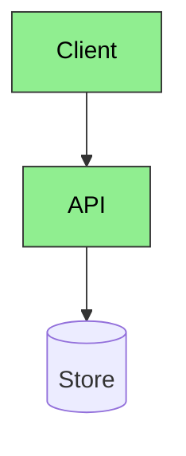

# GitHub wiki and WikiTicket SDD

TOKEN_BUDGET: 420
LOAD_TRIGGER: WikiTicket design docs, GitHub wiki, architecture Markdown, code walkthroughs

## Why this guide exists

GitHub Flavored Markdown and GitHub wiki render fenced `mermaid` blocks.
They do not render PlantUML source. WikiTicket SDD publishes
`docs/designs/` to the GitHub wiki. Broken Mermaid on that path is a
publish defect.

## Companion skills

| Need | Skill |
|------|--------|
| Prose (STE100 default) | `document-specialist` |
| C4, flowchart, sequence, architecture on GitHub | `design-doc-mermaid` (this skill) |
| Class, ER, state, component UML plus image export | `plantuml` |

Do not invent a third diagram skill name. Do not mix STE100 and Google
style in one document.

## Reliability rules

1. Derive nodes from code, config, or events. Do not invent services.
2. Cap a diagram at about 16 nodes. Write `+N more` instead of silent truncation.
3. Prefer `flowchart TD` or `sequenceDiagram`. Avoid experimental diagram types that GitHub does not render.
4. Quote reserved words in node ids (`end`, `default`, `class`, `subgraph` labels that collide).
5. Every `classDef` must set `color:`. Light fill needs dark text.
6. Validate with `scripts/resilient_diagram.py` or `mmdc` before the Markdown is committed.
7. Keep a `.mmd` source next to the Markdown when the diagram is non-trivial.
8. On WikiTicket pages, embed the fenced Mermaid block so the wiki renders it. Also keep the `.mmd` for recovery.

## GitHub-safe patterns

Use:



Avoid:

- `click` handlers and `init` frontmatter that GitHub strips
- Unquoted `end` as a node id
- Nested subgraphs deeper than two levels
- HTML that GitHub wiki sanitizes away

## WikiTicket output layout

```
docs/designs/current_design_doc.md          # fenced mermaid in place
docs/designs/current_code_walkthrough.md
docs/diagrams/<doc>_<num>_<type>_<title>.mmd
docs/diagrams/<doc>_<num>_<type>_<title>.png   # optional fallback image
```

When PlantUML is also required, store `.puml` plus PNG/SVG under
`docs/diagrams/` and link the image from the Markdown. Leave the Mermaid
block as the live GitHub view.

## Selection

| Show | Tool |
|------|------|
| System context, containers, request flow | this skill |
| Class hierarchy, ER, state machine image | `plantuml` |
| Captions and surrounding prose | `document-specialist` |
